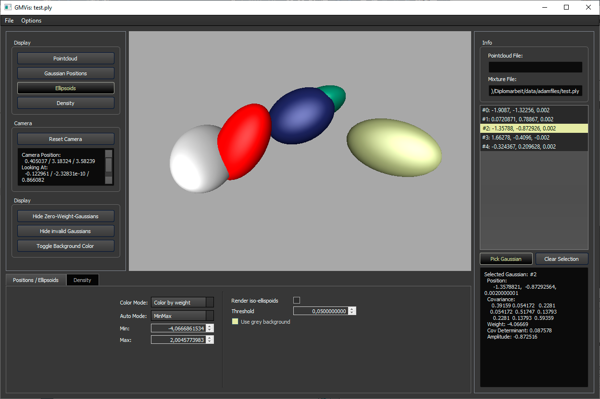
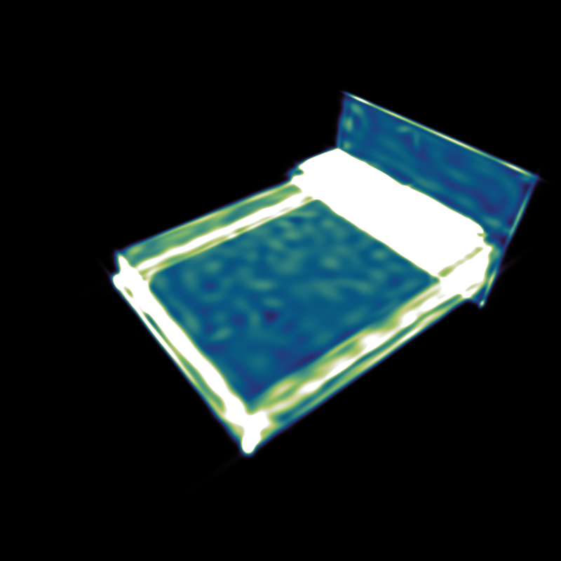
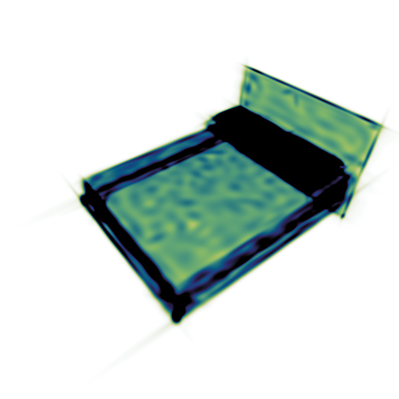
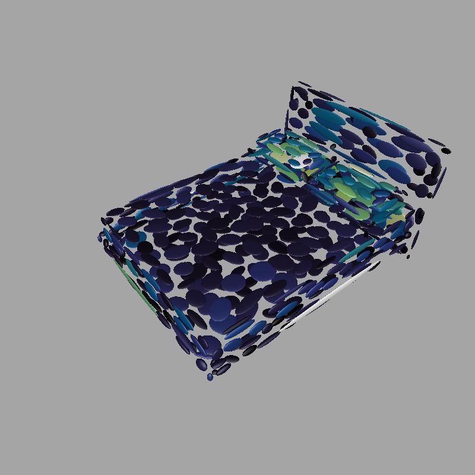
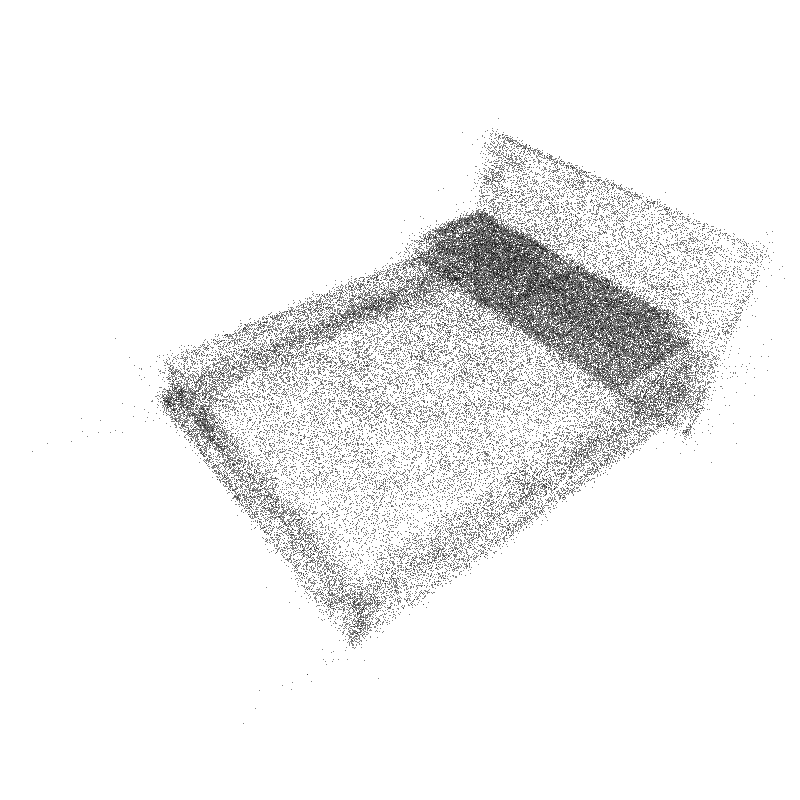

# Gaussian Mixture Model visualization toolkit

This toolkit was written as part of the diploma thesis [Construction and Visualization of Gaussian Mixture Models from Point Clouds for 3D Object Representation](https://www.cg.tuwien.ac.at/research/publications/2022/FRAISS-2022-CGMM/FRAISS-2022-CGMM-thesis.pdf).
Its main features are an ellipsoid visualization and a density visualization of 3D Gaussian Mixtures. These visualization are provided in both a standalone graphical user interface and a Python interface.

Current dependencies are Eigen (included in repo), Python, Pybind11 (provided as submodule - make sure to call ```git submodule update --init```), Qt (5 or 6). See CMakeLists.txt for details.

<p align="center"></p>
<p align="center">

</p>

## GUI functionality
Features of the visualizer in the graphical user interface build (CMake target visualizer):
* Loading data:
    * *File->Load Pointcloud*: Loads a pointcloud in the OFF-format (see data-folder for examples)
    * *File->Load Mixture Model*: Loads a Gaussian mixture model in the PLY-format. The given prior weights will be divided by the their sum during loading. See .gmm.ply-files in data folder for examples.
    * *File->Load Mixture with Amplitudes*: Loads a Gaussian mixture where Gaussian amplitudes are given instead of prior weights (the amplitude is the highest value of the Gaussian, e.g. priorweight / sqrt((2pi)^3 |Sigma|) ). See .gma.ply-files in data folder for examples.
    * *File->Load Line*: An experimental feature to display lines, e.g. for visualizing paths of moving Gaussians.
* In the *Display*-section on the left, the available visualization techniques can be enabled/disabled. In the setting section on the bottom of the window, the visualization parameters may be changed. The following visualizations are available:
    * **Pointcloud**: Displays the loaded point cloud (if any)
    * **Gaussian Positions**: Displays points on the mean positions of the Gaussians. This is useful for detecting small Gaussians which may not be visible in the other visualizations. In the settings section, their colors might be changed to correspond to their prior weights or amplitudes. Also, a gray background option is available to better see Gaussians of all colors.
    * **Ellipsoids**: Displays one ellispoid per Gaussian. In the setting section, their colors might be changed to correspond to their prior weights or amplitudes. Also, a gray background option is available to better see Gaussians of all colors. Per default, each ellipsoid is the sets of all points which have a Mahalanobis distance of 1 to the Gaussian's mean. An alternative, treshold-based calculation method is available by clicking the button "Render iso-ellipsoids", however this is experimental and not recommended!
    * **Density**: An additive density visualization. In the settings, the brightness intensity may be changed via the slider or manually through the min/max-values. These values define which pixel values are mapped to black and white. If the button *Symmetric Lock* is active each change of the max or min value will automatically change the other value to its negative value. If *Logarithmic* is checked, logarithmic density values will be used. When a new mixture is loaded, the settings are reset automatically, except if the button *Lock values for new mixture* is checked. *Reset values* will reset the values to their default value for the current file. *Min/Max Render* will set the highest and lowest pixel values as min/max-values (once). Different RenderModes are available, "Fast (Projection)" should work most times. If the results look wrong, the slower "Exact" mode can be used instead. The "Fast"-Methods require a set Acceleration-Threshold, which is usually chosen automatically.
    * **Isosurface**: This is an experimental and still buggy isosurface-visualization! The isovalue may be set in the settings. The results are not guaranteed to be correct!
* Additionally, on the left, buttons are available to reset the camera position, hide zero-weight-Gaussians, invalid Gaussians (e.g. no positive-definite covariance matrix) or to toggle the background color (and color mapping).
* On the right, a list of Gaussians is available. When selecting one, the corresponding Gaussian is colored red in the ellipsoids or positions rendering. If "Pick Gaussian" is selected, a Gaussian can be picked inside the ellipsoid or positions rendering.

## Python-Interface
Building the CMake target pygmvis creates a python interface. To use this interface, place the generated files (on Windows: pygmvis.lib, pygmvis.\*.pyd, Qt\*.dll) in the same folder as your python code. Here is an example code that illustrates the usage:

```python
import pygmvis
import matplotlib
import matplotlib.pyplot as plt
matplotlib.use('TkAgg') # Backend Qt5Agg creates problems when using GMVis, so rather use TkAgg or something else

# Create the visualizer. Parameters: 1) Use asynchronous rendering (result returned by callback), 2) width, 3) height
vis = pygmvis.create_visualizer(False, 500, 500)

# The vis-object provides access to all functions shown in gmvis/pylib/Visualizer.cpp
# Set camera position automatically to given mixture model
vis.set_camera_auto(True)
# Enable density rendering
vis.set_density_rendering(True)
# Pass Mixture from path. Second parameter states that the weights are given as amplitudes rather than prior weights that sum to one
vis.set_gaussian_mixtures_from_paths(["data/bed_0001.gma.ply"], False)
# Render the result. Parameter is a number used to identify render calls in asynchronous mode. The result is an array of shape (b, r, h, w, 4),
# where b is the number of mixtures, r the number of enabled visualizations, h the height, w the width, and 4 is the number of color channels.
res = vis.render(0)[0, 0]
# When a visualizer is not required anymore, finish should be called to properly shutdown!
vis.finish()

# Plot result
f1 = plt.figure("Rendering")
f1.figimage(res)
plt.show()
```

A possible pytorch-wrapper around pygmvis including more detailed documentation of the available functions is available in [doc/gm_vis_wrapper.py](doc/gm_vis_wrapper.py).

